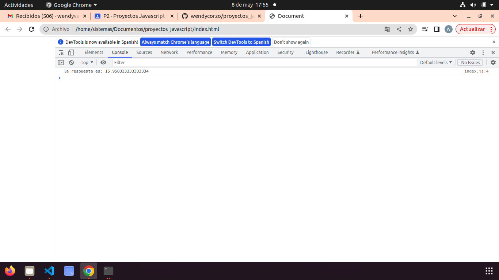

## ejemplo Teoría

## 1calculadora
primero tenian en cuenta que constaba de dos partes: la pantalla y las teclas,para identificar las claves de operador, decimal, proporcionaron un atributo de acción de datos que describa lo que hace
usaron 

       
0

## 2 menu1
vi que se podia dividir en 3 partes
el div: que donde la estructura del elemento despegable será definida
el elemento tambien llamado #result, que contiene la opcion seleccionada por el usuario, obtenido del elemento despegable.
el script escrito dentro del tag <script>

## 3 Toggle

 

## 4 Dark Theme
primero escribieron el codigo html para una pagina web y aplicaron css para el tema claro tambien crearon un estilo usando css para el tema oscuro y un boton y agregaron un evneto onclick en el boto.

## 5 menu despegable
